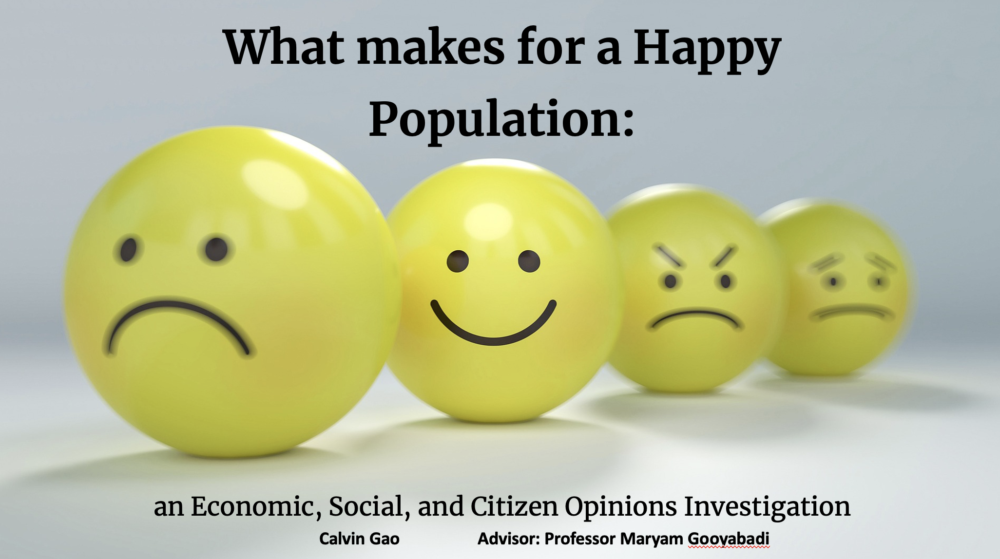

# What Makes for a Happy Population: an Economic, Social, and Citizen Opinions Investigation

## Description
This is a capstone research project for the Applied Data Science Certificate Program at Wesleyan University.

- **AUTHOR:** Calvin Gao
- **ADVISOR:** Professor Maryam Gooyabadi

## Useful Code Sources:

-   [Data_clean_merge.R](https://github.com/cgao1/CADS-Capstone/blob/main/Code/Data_clean_merge.R) contains code for data cleaning and data management on the World Health Report and the World Bank.

-   [Analysis.R](https://github.com/cgao1/CADS-Capstone/blob/main/Code/Analysis.R) contains code for fixed effects regression models, K-means clustering, and world maps.

## Other Materials:

-   [Codebook.pdf](https://github.com/cgao1/CADS-Capstone/blob/main/codebook.pdf) contains the codebook and description of all the variables collected from the World Happiness Report and World Bank.
-   [CodebookLPI.pdf](https://github.com/cgao1/CADS-Capstone/blob/main/codebook%20LPI.pdf) contains the codebook and description of the variables for the Legatum Prosperity Index.

-   [Presentation_One.pptx](https://github.com/cgao1/CADS-Capstone/blob/main/Presentation_One.pdf) contains my presentation slides for the Quantitative Analysis Center student speakers series and outlines literature reviews, variables, dataset subsets and analytical methods completed as of the day of presentation. These slides present the progress within the semester and does not have the complete analysis.

-   contains my presentation slides for the final presentation and adds on to the previous slides through visualizations, gap analysis, findings, and recommendations.

-   [cgao_CADS_capstone_spring2023.pdf]() is the final paper of this presented work.
